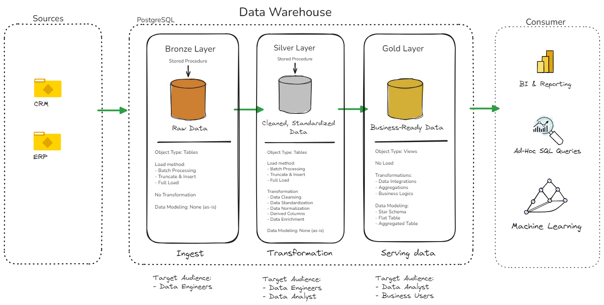

# Sales Data Warehouse and Analytics Project I
Hello, and welcome to the sales data warehouse and analytics projects. 
The purpose of this project is to demonstrate an understanding of basic data warehousing and analyics solutions, where we build the data warehouse to create insights from the data sets. This project portfolio, highlights the industry best practices and allows others to get a fundamental understanding of what goes into building data warehouses for a company. 
***
##  Data Warehouse Architecture
---
The data warehouse is using the Medallion Architecture Bronze, Silver, and Gold layers: 

1. **Bronze Layer**: Stores raw data as-is from the source systems. The data is ingested from CSV files into a PostgreSQL database.
2. **Silver Layer**: At this stage we will transform our data by cleaning, standardizing and normalizing it to match naming convention standards we will set.
3. **Gold Layer**: In this layer we will have a business ready model that contains our business logic for reporting analysis.

---
## Project Overview

This project involves: 

1. **Data Architecture**: Designing a Modern Data Warehouse Using Medallion Architecture **Bronze**, **Silver**, and **Gold** layers.
2. **ETL Pipelines**: Extracting, transforming, and loading data from source systems into the warehouse.
3. **Data Modeling**: Developing fact and dimension tables optimized for analytical queries.
4. **Analytics & Reporting**: Creating SQL-based reports and dashboards for actionable insights.

For anyone wanting to showcase their skills this project is an excellent resource. 

## List of Tools used for this project: 
- **[Datasets](datasets/):** Data sources used for the project.
- **[PostgreSQL](https://www.postgresql.org/):** Databased used to house source data, perform transformations, and deliver reports.
- **[Github](https://github.com):** Create an account to store, manage, perform version control, and collaborate on code.
-**[Notion](https://notion.io):** Create an account and create a project template.
-**[Obsidian](https://obsidian.md/):** Used for note takeing along with the Exalidraw community plugin for drawing architecture.

## Project Requirements

### Building the Data Warehouse (Data Engineering)
#### Objective
Develop a modern data warehouse using PostgreSQL to consolidate sales data, enabling analytical reporting and informed decision-making.

#### Specifications
**Data Sources**: Import data from two source systems (ERP and CRM) provided as CSV files. 
**Data Quality**: Cleanse and resolve data quality issues prior to analysis
**Integration**:  Combine both sources into a single, user-friendly data model designed for analytical queries. 
**Scope**: Focus on the latest dataset only; historization of data is not required. 
**Documentation**:  Provide clear documentation of the data model to support business stakeholders and analytics teams. 

---

### BI: Analytics & Reporting (Data Analysis) 
#### Objective
Develop SQL-based analytics to deliver detailed insights into: 
- **Customer Behavior**
  - Summary of total number of customers, total sales per customer and total number of orders for the current year and previous year.
  - Present data for each KPI on a monthly basis for both the current year and the previous year
  - Identify months with the highest and lowest purchases 
  - Represent the distribution of customers based on the number of orders they have placed to provide insights into customer behavior, loyalty and engagement 
  - List top 10 customer who have generated the highest profits for the company. 
  - Show additional information like rank, number of orders, current sales, current profit and the last order date. 
- **Product Performance**
  - Compare sales performance by different product subcategories for the current year and previous year. 
  - Include a comparison of sales with profit.
- **Sales Trends** 
  - Summary of total sales, profits and quantity for the current year and previous year.
  - Identify months the highest and lowest sales. 
  - Present weekly sales and data for the current year. 
  - Display the average weekly values
  - Highlight weeks that are above and below the average to draw attention to sales & profit performance.
- **Data Filters**
  - Category and Subcategory
  - Location: region, state, city

These insights empower stakeholders with key business metrics, enabling strategic decision-making. 

---
## Projet Task Order
1. [Create DB and Schemas](docs/create_db_schema.md)
2. [Build Bronze Layer](docs/build_bronze_layer.md)
3. [Build Silver Layer](docs/build_silver_layer.md)
4. [Build Gold Layer](docs/build_gold_layer.md)

---

## 🛡️ License

This project is licensed under the [MIT License](LICENSE). You are free to use, modify, and share this project with proper attribution.
